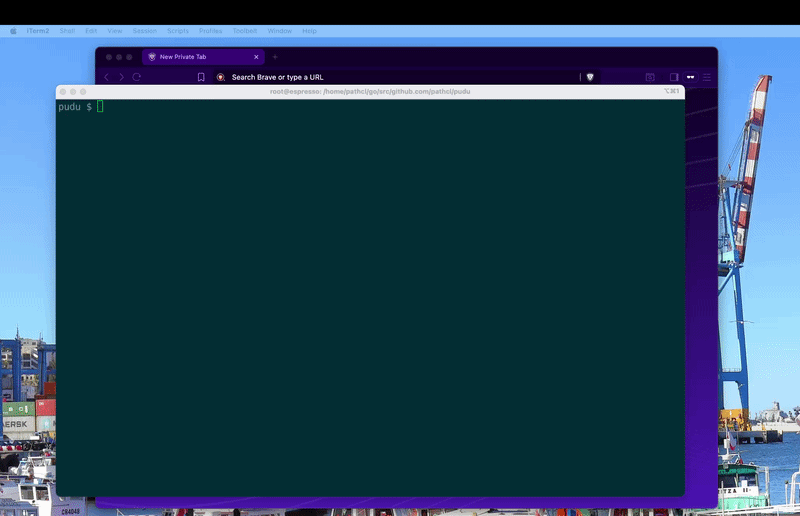

# pudu

## Demo



A chaos engineering platform for SRE on-call training, built on [Firecracker](https://firecracker-microvm.github.io/) microVMs.

Pudu launches fleets of lightweight VMs, injects realistic production failures (disk full, memory leaks, network latency, process crashes, DNS hijacks), and scores trainees on how quickly they diagnose and resolve the incident.

## Prerequisites

| Requirement | Notes |
|---|---|
| Linux x86_64 | KVM-enabled host |
| `/dev/kvm` accessible | Run as root or add user to `kvm` group |
| Go 1.21+ | To build from source |

## From-scratch setup

```bash
# 1. Install system dependencies (firecracker, iproute2, iptables, cloud-image-utils)
make deps

# 2. Build binaries (run as your regular user — Go is not in root's PATH)
make build          # produces: pudu, pudu-agent, puduc/puduc

# 3. Download kernel + Ubuntu 22.04 rootfs, install agent into rootfs
make assets         # ~500 MB download, takes a few minutes
```

That's it. TAP networking is created automatically when VMs launch — no manual `net-up` step needed.

## SSH credentials

```
User: root
Password: root
```

---

## Usage: REST API server + puduc client

Start the server (needs root for Firecracker + TAP):

```bash
make server
# or manually:
sudo ./pudu server --kernel vmlinux.bin --rootfs rootfs.ext4 --cloud-init-iso cloud-init.iso --port 8888
```

From another terminal, use `puduc` (no root required):

```bash
# Install to PATH for convenience
sudo cp puduc/puduc /usr/local/bin/puduc

# Launch a fleet of 2 VMs
puduc fleet create --count 2

# List fleets
puduc fleet list

# Stop a fleet
puduc fleet delete <id>

# Run a scenario
puduc scenario run scenarios/monolith/disk-full.yaml

# Check live status + score
puduc scenario status <id>

# Request a hint (costs points)
puduc scenario hint <id>

# Abort a scenario
puduc scenario abort <id>

# Point puduc at a remote server
export PUDU_SERVER=http://192.168.1.10:8888
```

---

## Usage: direct CLI (no server)

### Single VM

```bash
sudo ./pudu run --kernel vmlinux.bin --rootfs rootfs.ext4 --cloud-init-iso cloud-init.iso
```

### Fleet + web terminal

```bash
N=3 make serve
# open http://localhost:8888
```

### Scenario

```bash
# Easy — disk full (1 VM, monolith)
sudo make scenario SCENARIO=scenarios/monolith/disk-full.yaml

# Medium — DB connection cascade (3 VMs, microservices)
sudo make scenario SCENARIO=scenarios/microservices/db-connection-exhaustion.yaml
```

Once running, open **http://localhost:8888** in your browser and investigate.

---

## Architecture

```
┌──────────────────────────────────┐      ┌─────────────────────┐
│  pudu server  (runs as root)     │      │  puduc  (CLI client) │
│                                  │◀────▶│                      │
│  /api/v1/fleets        (REST)    │ HTTP │  puduc fleet create  │
│  /api/v1/scenarios     (REST)    │      │  puduc scenario run  │
│  /ws?vm=N              (WS SSH)  │      │  puduc terminal N    │
│  /                     (web UI)  │      └─────────────────────┘
└──────────────────────────────────┘
         │
         │ Firecracker
         ▼
┌─────────────────────┐    ┌───────────────────────┐
│  microVM (tapN)      │    │  pudu-agent  :7777    │
│  172.16.N.2          │───▶│  /fault/start         │
│                      │    │  /fault/stop          │
└─────────────────────┘    │  /metrics             │
                            └───────────────────────┘
```

Networking is created on-demand: each VM gets a dedicated `/30` subnet with its TAP device created automatically at launch time.

| VM index | Host gateway | VM IP |
|---|---|---|
| 0 | `172.16.0.1` | `172.16.0.2` |
| 1 | `172.16.1.1` | `172.16.1.2` |
| N | `172.16.N.1` | `172.16.N.2` |

SSH into any VM: `ssh root@172.16.N.2` (password: `root`)

---

## Scenario YAML format

```yaml
scenario:
  id: my-scenario-001
  title: "The Disk That Ate Everything"
  difficulty: easy          # easy | medium | hard | expert
  architecture: monolith    # monolith | microservices | both
  tags: [disk, storage]
  description: |
    Narrative shown to the trainee at scenario start.

environment:
  tiers:
    - name: app
      count: 1
      vcpus: 1
      mem_mb: 512
      services: [nginx, app-server]

faults:
  - id: disk-fill-app
    type: disk              # cpu | memory | disk | network | process | dns
    target:
      tier: app
    params:
      path: /
    at: 0s
    duration: 10m

signals:
  alerts:
    - name: DiskSpaceLow
      severity: critical
      fired_at: 0s
      message: "Disk usage above 95%"
  symptoms:
    - "nginx returns 502 Bad Gateway"

objectives:
  - id: disk-recovered
    description: Disk usage below 80% on app-0
    check:
      type: agent-metric
      target:
        vm: app-0
      metric: disk_used_pct
      condition: "< 80"

hints:
  - text: "Check disk usage with: df -h"
  - text: "Look for large files: du -sh /* 2>/dev/null | sort -rh | head -20"

scoring:
  base: 100
  time_penalty_per_second: 0.05
  hint_penalty: 10
  perfect_window: 5m
```

### Fault types

| Type | Key params | Effect |
|---|---|---|
| `cpu` | `load` (e.g. `80%`) | Saturates CPUs to target percentage |
| `memory` | `rate` (e.g. `30mb/min`), `ceiling` (e.g. `85%`) | Simulates a memory leak |
| `disk` | `path` (default `/`) | Fills filesystem by writing a hidden file |
| `network` | `action` (delay/loss/corrupt), `latency`, `jitter`, `packet_loss` | Uses `tc netem` |
| `process` | `service`, `action` (stop/restart/degrade) | Manipulates systemd services |
| `dns` | `record`, `resolve_to` | Injects a spoofed entry into `/etc/hosts` |

### Objective check types

| Type | Fields | Passes when |
|---|---|---|
| `http` | `path`, `expected_status` | HTTP GET returns expected status |
| `agent-metric` | `metric`, `condition` | Metric satisfies condition (e.g. `disk_used_pct < 80`) |
| `process-running` | `service` | systemd service is active |

Available metrics: `cpu_pct`, `mem_used_pct`, `disk_used_pct`, `disk_free_mb`, `load_avg_1`

---

## Included scenarios

| File | Difficulty | Description |
|---|---|---|
| `scenarios/monolith/disk-full.yaml` | Easy | Disk fills completely, app returns 500s |
| `scenarios/microservices/db-connection-exhaustion.yaml` | Medium | Three-stage cascade: DB CPU spike → network latency → API memory leak |

---

## Makefile targets

```bash
make deps           # install firecracker + system dependencies
make build          # build pudu, pudu-agent, puduc
make build-puduc    # build puduc client only
make assets         # download kernel + rootfs, install agent into rootfs
make server         # start REST API server on :8888
make serve          # launch fleet + web terminal (direct, N=3 default)
make scenario       # run SCENARIO= file (default: monolith/disk-full)
make clean          # remove binaries, images, logs
make cleanup        # tear down all TAP devices
```

---

## In-VM agent

`pudu-agent` runs inside each VM on port `7777`.

```bash
# Health check
curl http://172.16.0.2:7777/health

# Current metrics
curl http://172.16.0.2:7777/metrics

# Inject a fault manually
curl -X POST http://172.16.0.2:7777/fault/start \
  -d '{"id":"test","type":"cpu","params":{"load":"80%","duration":"30s"}}'

# Stop a fault
curl -X POST http://172.16.0.2:7777/fault/stop \
  -d '{"id":"test"}'
```

## Cleanup

```bash
make cleanup    # remove TAP devices
make clean      # remove all build artifacts and downloaded images
```
